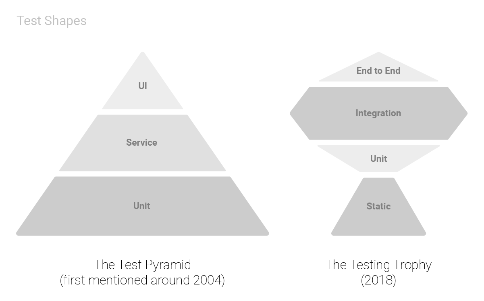

# Intro

## What is a test?

- Something that throws if the subject under test doesn't get the expected results

## The testing pyramid

- Testing the app is easier than testing the code
- Testing and TDDing are different things
- **Top to bottom is an easier journey for a front-end developer**
- Every project needs UI tests, not all projects need Unit tests

## Why writing tests?

- To ensure the code/app does what we expect
- To avoid regressions
- To **reproduce edge cases**
- To automate checks
- To perform checks forever
- To **document the code**
- To prevent problems
- To **allow refactoring**
- To improve the quality of the code
- To work with few responsibilities

## What are the goals of the course?

- To learn the most important testing best practices
- To leverage tests as a development tool and reduce the necessary time
- To gain the most confidence with the least amount of tests
- To reduce the cost of testing, especially at the beginning, helpful even to get the tests accepted by your company
- To avoid initial false confidence

## What are we going to do? and how?

- Incremental exercises
- Exercises won't be easy for you, the harder they are, the more you learn

## We use Cypress

- Easy debugging
- Bornt only for UI tests
- It has a friendly UI
- It's free and OS
